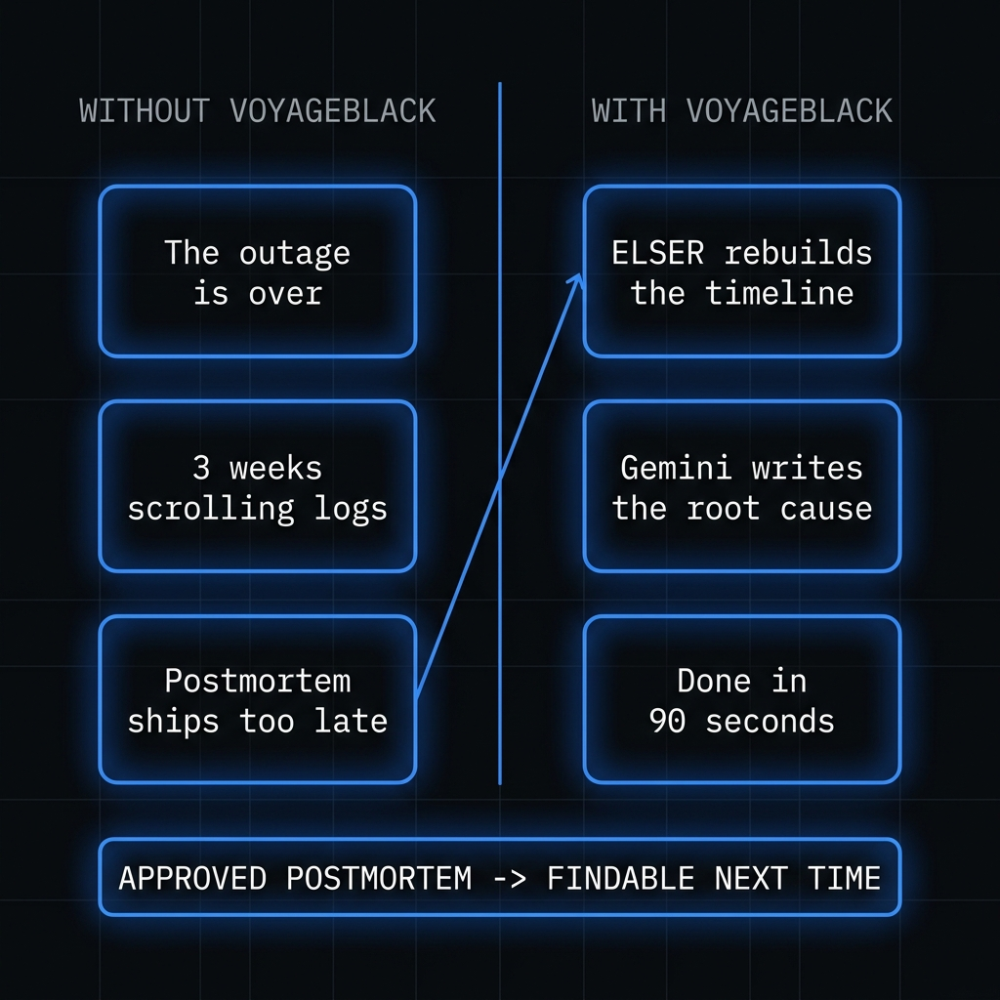
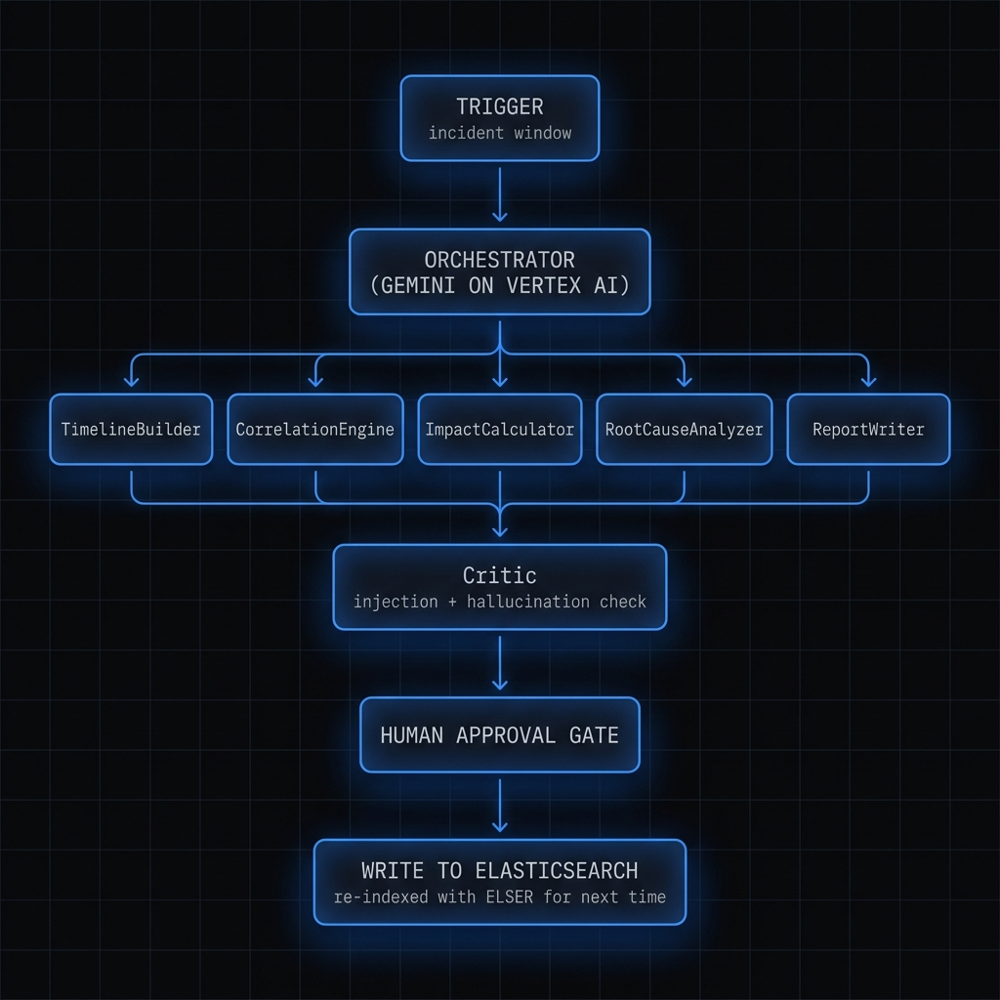
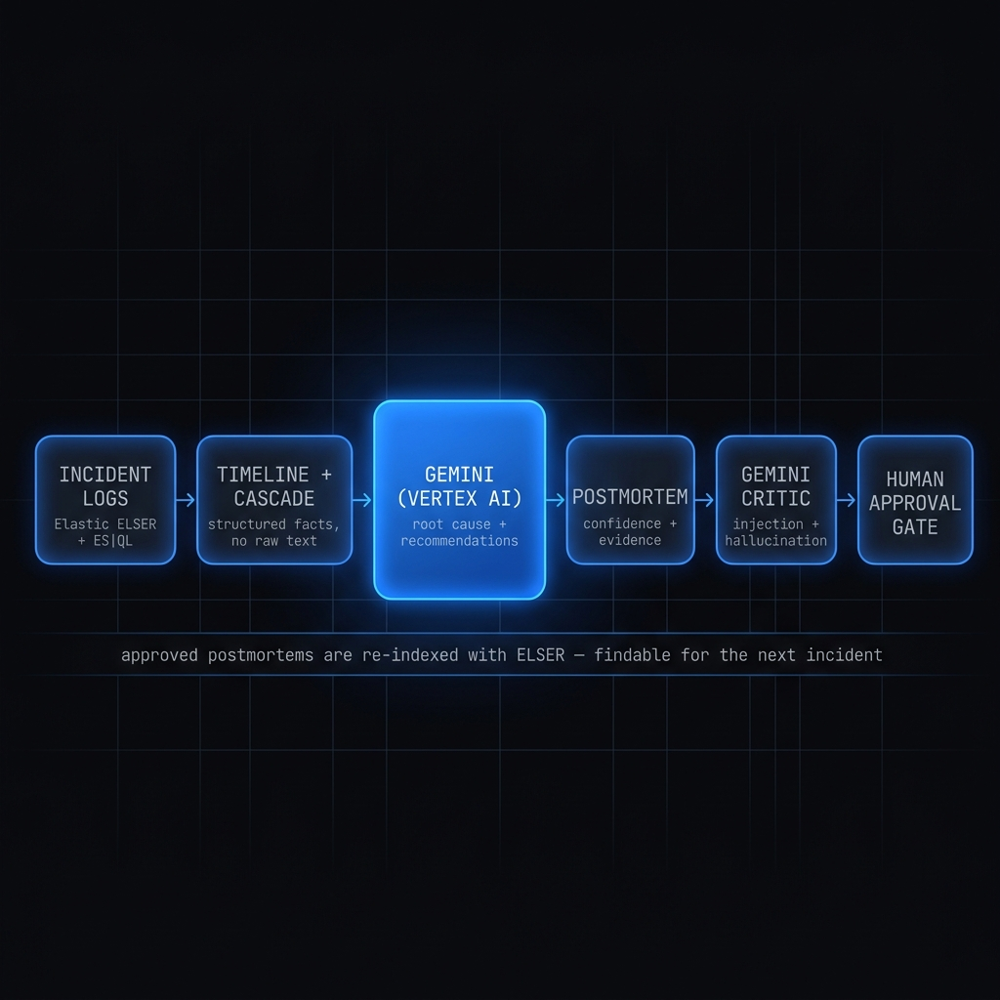

# VoyageBlack

**Your worst incident took 3 weeks to document. This takes 90 seconds.**

VoyageBlack turns raw incident logs into a written, evidence-backed
postmortem — timeline, blast radius, root cause, and recommendations —
in about 90 seconds. It reads your logs from Elasticsearch, reasons over
them with Gemini, recalls similar past incidents from its own memory, and
hands you a draft to review. You approve; it writes back. The next time
something similar breaks, it already remembers.

Powered by Elastic (ELSER semantic search + Agent Builder MCP) and
Gemini on Vertex AI.

---

## The problem

Postmortems are the most valuable artifact your team produces and the one
you're least likely to write. By the time the fire is out, the on-call
engineer is exhausted, the logs have scrolled off the screen, and the
causal chain that was obvious at 3am is a fog by morning. So the report
gets deferred, then skipped, then forgotten — and the same failure mode
walks back through the front door six weeks later because nobody wrote
down what happened the first time.

The data you need is already sitting in Elasticsearch. What's missing is
the 90 minutes of focused reconstruction nobody has after an outage:
stitching the timeline across services, finding which error came first
versus which were downstream casualties, sizing the blast radius, and
articulating the root cause in a sentence a human can act on.



## How it works

VoyageBlack is a six-stage multi-agent pipeline. Each stage is a Python
specialist built on Google's Agent Development Kit (ADK), running as a
code-owned service on Cloud Run. Gemini does the semantic reasoning that
code cannot; your code formats the evidence and constrains the output.



```
Incident window (id + start + end)
        │
   1. TimelineBuilder      reconstruct the timeline from logs        [Agent Builder MCP]
        │
   2. CorrelationEngine    group errors by service, infer cascade    [Agent Builder MCP]
        │
   3. ImpactCalculator     blast radius via ES|QL aggregations       [standalone ES MCP]
        │
   4. RootCauseAnalyzer    reason over structured evidence only      [pure Gemini]
        │
   5. ReportWriter         recall similar past incidents (ELSER)     [Agent Builder MCP]
        │
   6. Critic               injection defense + approval gate         [pure Gemini, always last]
        │
   PostmortemDraft  ──►  human review  ──►  approve  ──►  written to Elasticsearch
```

Every stage streams its chain-of-thought to the dashboard live (see
[Live Gemini thinking](#live-gemini-thinking) below). Nothing is written
anywhere until a human approves. Recommendations are generated by Gemini
from the actual evidence — each one cites a specific service or event —
never templated or hardcoded.

This is a precision instrument for any team that ships logs to Elastic.

---

## Built for any system, demonstrated on maritime

**VoyageBlack is demonstrated on maritime incidents but works for any
system that writes logs to Elastic** — SaaS outages, fintech payment
cascades, gaming backends, recommendation pipelines, anything with a
correlation ID and a timestamp. The shipping scenario is the demo, not
the product.

To prove this, the dashboard ships with two one-click demos:

- **Hormuz Crisis** (maritime) — a routing-engine failure cascades through
  `naviguard → ukmto-feed → cargo-tracker` during a Strait of Hormuz
  advisory. Incident `HORMUZ-2026-0601`, window `14:57Z → 15:02Z`.
- **Auth Outage** (generic SaaS) — an OIDC signing-key rotation expires a
  JWKS cache and halts `auth-service → payment-service →
  notification-service → api-gateway`. Incident `AUTH-OUTAGE-2026-0607`.

Same pipeline, same code, two completely different domains. Click **Load
Auth Outage Demo** in the dashboard to run the non-maritime path.

---

## The memory flywheel

VoyageBlack gets smarter every time you use it. This is the part that
turns a report generator into an institutional memory.

Postmortems are stored in the `postmortems-shipsafe` Elasticsearch index
on a `semantic_text` field. Elastic's ELSER model
(`.elser-2-elasticsearch`) auto-embeds them on ingest — no embedding
pipeline code, no separate vector store. When a new incident comes in,
the **ReportWriter** stage calls the `similar_past_incident` Agent Builder
tool, which runs ELSER semantic search over every postmortem you've ever
approved.

```
new incident ──► similar_past_incident (ELSER) ──► "we've seen this before"
      ▲                                                      │
      └──────── approved postmortem re-indexed ◄─────────────┘
```

The demo seeds a prior **Red Sea 2024** postmortem so the very first run
returns a real semantic match — you see the flywheel working before
you've written anything yourself. Approve the new draft, run a similar
incident again, and your fresh postmortem now surfaces as a match too.

---

## Two MCP servers

VoyageBlack integrates Elastic through **two** Model Context Protocol
servers, each for what it does best.


### Agent Builder MCP (custom domain tools)

Five tools defined in the Kibana Agent Builder UI, exposed over the
managed MCP endpoint. Used by TimelineBuilder, CorrelationEngine, and
ReportWriter:

| Tool | What it does |
|---|---|
| `incident_logs_timewindow` | Fetch logs in a time window by correlation ID (ES\|QL) |
| `incident_logs_semantic` | Semantic search over logs using ELSER |
| `service_error_correlation` | Aggregate errors by service + error code |
| `similar_past_incident` | ELSER semantic search over `postmortems-shipsafe` |
| `write_postmortem` | Defined in Agent Builder, but **not** the write path — see note below |

### Standalone Elasticsearch MCP (`docker.elastic.co/mcp/elasticsearch`)

Generic Elasticsearch access — `list_indices`, `search`, `esql`. The
**ImpactCalculator** uses the `esql` tool to run raw ES|QL aggregations
for blast radius, deliberately exercising a second, independent MCP
server. Runs as the `es-mcp-server` Cloud Run service in production, or
via Docker stdio in local dev.

> **How the write actually happens.** Approval does *not* invoke the
> `write_postmortem` MCP tool. `ReportWriter.write()` performs a direct
> Elasticsearch REST `PUT` to `postmortems-shipsafe/_doc/{incident_id}`.
> This is deliberate: a direct write guarantees the full document is
> indexed with the `semantic_text` field populated so ELSER embeds it for
> future recall. The `write_postmortem` tool exists in the Agent Builder
> catalog but is never called.

---

## Live Gemini thinking



VoyageBlack is the reference implementation for live chain-of-thought in
the ShipSafe fleet. All six stages stream Gemini's reasoning to the UI as
it happens.

Each specialist runs with `include_thoughts=True` and writes thinking
tokens into an `asyncio` queue (`run_agent_with_thinking` /
`run_gemini_direct_with_thinking` in `agent/runner_utils.py`). The
`/run/stream` SSE endpoint drains that queue and emits `thinking_chunk`
events; the dashboard renders a per-stage typewriter that types out
"Gemini thinking" in real time, then collapses to a one-line result when
the stage completes. You watch the model reason about your incident, not
a spinner.

---

## The human approval gate

No verdict ever auto-executes. The pipeline is split in two:

1. **`POST /run`** (or `GET /run/stream` for the live UI) runs all six
   stages and returns a `PostmortemDraft` with status `draft` and the
   Critic's verdict. **Nothing is written to Elasticsearch.**
2. **`POST /approve/{incident_id}`** — triggered only by the operator
   clicking **"Approve & Write to Elastic"** — calls
   `ReportWriter.write()`, which writes the postmortem back to
   Elasticsearch.

The **Critic** is the last stage in every run and enforces prompt-injection
defense in two layers: a deterministic regex scan (fast, no LLM) and a
Gemini semantic review (catches paraphrased injection). It fails closed —
any error or detection sets `approved=false` and
`requires_human_review=true`. If injection is detected in the log content,
the dashboard's **Approve button is disabled** and the write is blocked.

### Injection defense by design

User-controlled content (log messages) is treated as **data, never
instructions**. The **RootCauseAnalyzer** — the stage that draws the
final causal conclusion — receives *only* structured fields (service
names, error counts, cascade depths, event IDs). It never sees raw log
message text, so a crafted log line cannot steer the verdict. Raw text is
scanned by the Critic but never concatenated into a reasoning prompt.

---

## Quickstart

### Demo (zero configuration)

```bash
npx shipsafe-voyageblack demo
```

Seeds the Hormuz crisis fixtures, waits for ELSER to embed them, runs the
full pipeline streaming each stage, and prints the postmortem URL. Then
open the dashboard, review the draft, and approve it.

### Connect your own Elasticsearch

```bash
npx shipsafe-voyageblack init      # configure GCP secrets, verify both MCP servers
npx shipsafe-voyageblack connect   # point at your Elastic Cloud + Agent Builder MCP
```

### Run an incident from the API

```bash
# 1. Generate a draft (nothing written yet)
curl -X POST "$AGENT_URL/run" -H 'content-type: application/json' -d '{
  "incident_id": "HORMUZ-2026-0601",
  "start_time": "2026-06-01T14:57:00Z",
  "end_time":   "2026-06-01T15:02:00Z"
}'

# 2. After human review, approve to write back to Elasticsearch
curl -X POST "$AGENT_URL/approve/HORMUZ-2026-0601" \
  -H 'content-type: application/json' -d @draft.json
```

---

## Architecture

- **Agent brains** — Python on Google ADK, deployed to Cloud Run. The
  orchestrator runs the six specialists sequentially with the Critic
  always last.
- **LLM** — Gemini on Vertex AI for *every* reasoning step. The model is
  read from the `GEMINI_MODEL` config (default `gemini-2.5-flash`), never
  hardcoded. Elastic's ELSER handles semantic embedding/search — it is
  Elastic's own model, not a third-party LLM.
- **Dashboard** — Next.js 14 (App Router) on Cloud Run, dark mission-control
  UI, live SSE pipeline view.
- **CLI** — `shipsafe-voyageblack`, published to npm: `init`, `demo`,
  `connect`.
- **Secrets** — every credential lives in GCP Secret Manager
  (`ELASTIC_CLOUD_URL`, `ELASTIC_API_KEY`, `ELASTIC_MCP_URL`,
  `ELASTIC_ES_MCP_URL`). Nothing hardcoded, nothing in `.env`.

### Deployed services (Cloud Run)

- **Agent API** — https://voyageblack-agent-o34wppiwiq-uc.a.run.app
- **Dashboard** — `voyageblack-dashboard`
- **Standalone ES MCP** — `es-mcp-server`

### Key endpoints

| Endpoint | Purpose |
|---|---|
| `POST /run` | Run the pipeline, return a draft (no write) |
| `GET /run/stream` | Same, as an SSE stream with live thinking |
| `POST /approve/{incident_id}` | Human gate — write the approved postmortem |
| `GET /postmortems` | List past postmortems (ES MCP `esql`) |
| `POST /demo/seed` | Seed Hormuz fixtures |
| `POST /demo/seed/generic` | Seed the Auth Outage fixtures |
| `GET /mcp/status` | Health-check both MCP servers |

---

## License

MIT. See [LICENSE](./LICENSE).

---

*Part of the [ShipSafe](https://github.com/shipsafe-ai) ecosystem — six AI
agents for production operations intelligence. 27 million developers.
6 agents. One command.*
