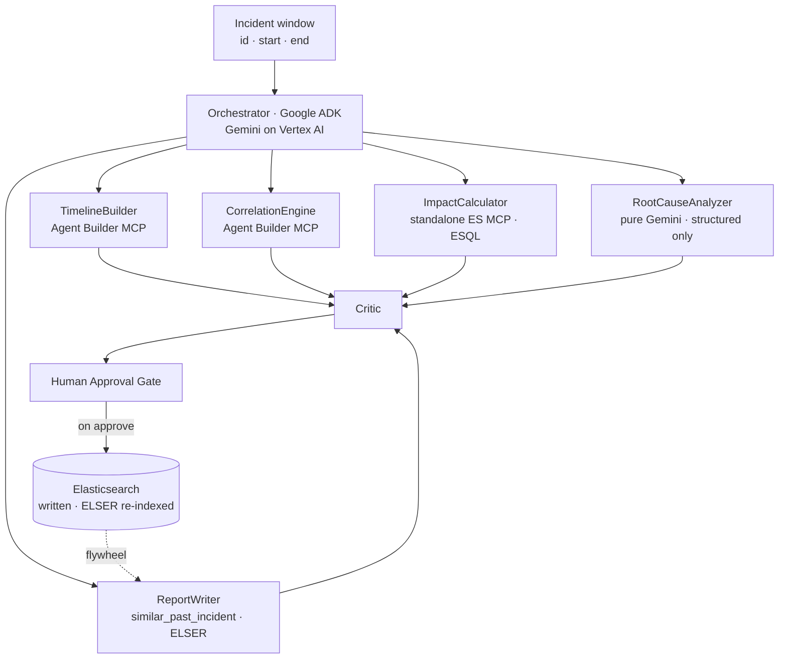

<!--
  VoyageBlack — Devpost "Project details" / "About the project"
  Paste the body below into Devpost. Upload the 4 PNGs in this folder to Project Media.
  Devpost does NOT render Mermaid — for the Devpost paste, drop the ```mermaid block
  (the uploaded PNGs cover it). On GitHub, both the PNGs and the Mermaid render.
-->

> **VoyageBlack is demonstrated on maritime incidents, but it works for any system that writes logs to Elastic** — SaaS outages, fintech payment cascades, gaming backends, recommendation pipelines.

## Inspiration

The postmortem is the most valuable artifact your team produces — and the one you're least likely to write. By the time the fire is out, the on-call engineer is exhausted, the logs have scrolled off the screen, and the causal chain that was obvious at 3am is a fog by morning. So the report gets deferred, then skipped, then forgotten — and the same failure mode walks back through the front door six weeks later because nobody wrote down what happened the first time.

The data you need is already sitting in Elasticsearch. What's missing is the 90 minutes of focused reconstruction nobody has after an outage. We built the agent that does it in 90 *seconds*.


## What it does

VoyageBlack turns raw incident logs into a written, evidence-backed **postmortem** — timeline, blast radius, root cause, and recommendations — in about ninety seconds. It reads your logs from Elasticsearch, reasons over them with **Gemini**, recalls similar past incidents from its own memory with **ELSER semantic search**, and hands you a draft to review. You approve; it writes back. The next time something similar breaks, it already remembers.

And it gets smarter every time: every approved postmortem is re-indexed with ELSER, so the *next* incident's "have we seen this before?" lookup finds it. The demo seeds a prior Red Sea 2024 postmortem so the very first run already returns a real semantic match — you watch the flywheel work before you've written anything yourself.

## How we built it

A six-stage pipeline on **Google ADK**, on **Cloud Run**, with **Gemini on Vertex AI** doing the reasoning code can't.

**System architecture — two Elastic MCP servers + ELSER:**


**The pipeline** — `TimelineBuilder → CorrelationEngine → ImpactCalculator → RootCauseAnalyzer → ReportWriter → Critic`, gated by a human:




**Gemini is the brain** — logs become a structured timeline and cascade, Gemini reasons to a postmortem with confidence and cited evidence, and a Gemini Critic checks it:


VoyageBlack integrates Elastic through **two** MCP servers: the **Agent Builder MCP** (five custom ELSER/ES|QL tools — `incident_logs_timewindow`, `incident_logs_semantic`, `service_error_correlation`, `similar_past_incident`) and the **standalone Elasticsearch MCP** (`esql`, for blast-radius aggregations). And it's the ShipSafe fleet's **reference implementation for live chain-of-thought** — all six stages stream Gemini's reasoning to the dashboard as it happens, via an `asyncio` thinking queue and SSE.

**Stack:** Python · Google ADK · Gemini 2.5 Flash (Vertex AI) · Elasticsearch + ELSER · Agent Builder MCP + standalone Elasticsearch MCP · ES|QL · FastAPI · Server-Sent Events · Next.js + Tailwind · Cloud Run · Secret Manager · Docker.

## Challenges we ran into

- **The 90-second reconstruction.** Stitching a timeline across services, working out which error came *first* versus which were downstream casualties, and sizing the blast radius is exactly the focused work nobody has after an outage. We split it across specialists and let Gemini do the causal reasoning over structured evidence.
- **Two MCP servers, on purpose.** The Agent Builder MCP exposes our custom ELSER tools; the standalone Elasticsearch MCP runs raw ES|QL for the blast radius. Wiring both — managed endpoint and a `docker.elastic.co/mcp/elasticsearch` service — proved real, multi-server MCP depth.
- **The memory flywheel.** Postmortems are stored on an ELSER `semantic_text` field that auto-embeds on ingest — no vector store, no embedding pipeline. The trick was making the *write* a direct Elasticsearch REST `PUT` (not an MCP tool) so the full document is indexed with `semantic_text` populated and instantly findable by `similar_past_incident`.
- **Injection defense by design.** Log messages are attacker-reachable, so the `RootCauseAnalyzer` — the stage that draws the final conclusion — receives **only structured fields** (service names, error counts, cascade depths, event IDs), never raw log text. A crafted log line literally cannot reach the reasoning prompt. The Critic adds a regex + Gemini two-layer scan and fails closed, disabling the Approve button on detection.

## Accomplishments that we're proud of

- **Three weeks of work, done in ninety seconds** — a complete, citable postmortem.
- **Two real Elastic MCP servers** plus ELSER semantic search across logs and past postmortems.
- A genuine **memory flywheel**: every approved postmortem makes the next investigation faster.
- **Live Gemini chain-of-thought across all six stages** — the fleet's reference implementation.
- **Injection-hardened** (structured-only root cause) and **human-gated** — nothing is written without a signature.

## What we learned

- The postmortem story is *already in your logs* — humans are just slow at reading ten thousand lines across a dozen services.
- ELSER `semantic_text` makes the memory flywheel nearly free: zero embedding infrastructure.
- Isolating the conclusion-drawing stage from raw text is the cleanest defense against prompt injection.
- Streaming the model's actual thinking turns a spinner into trust.

## What's next for VoyageBlack

- Auto-detect incidents and open the window automatically (no manual trigger).
- More log sources beyond Elastic-native ingestion.
- Multi-incident correlation — connect today's outage to last quarter's near-miss.
- Generate the runbook entry, not just the postmortem.

---

**Built with** (Devpost tag field): `python · google-adk · gemini · vertex-ai · elasticsearch · elser · model-context-protocol · esql · fastapi · server-sent-events · next.js · tailwindcss · google-cloud-run · secret-manager · docker`

**Try it out:**
- Live dashboard — https://voyageblack-dashboard-o34wppiwiq-uc.a.run.app
- GitHub — https://github.com/shipsafe-ai/shipsafe-voyageblack
- One command — `npx shipsafe-voyageblack demo`
